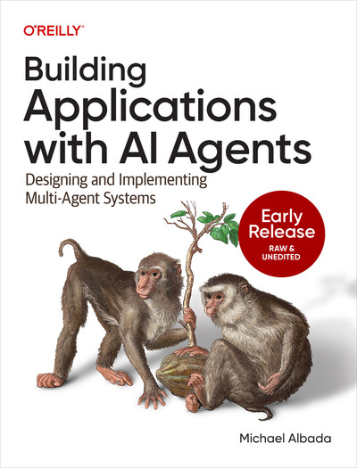

# Building Applications with AI Agents

[Overview](#overview) • [Book](#book) • [Features](#features) • [Installation](#installation) • [Usage](#usage) • [Directory Structure](#directory-structure) • [Examples](#examples) • [Testing](#testing) • [Contributing](#contributing) • [License](#license)

---

## Overview

This repository provides a **unified, multi-framework platform** for designing, implementing, and evaluating AI-powered agents. By separating **scenario definitions** from **framework-specific code**, we enable:

* A **single spec** for each scenario (under `src/common/scenarios/`).
* **Parallel implementations** in LangGraph, LangChain, Autogen (and more).
* A **shared evaluation harness** to compare outputs across frameworks.
* **Built-in observability** (Loki logging & OpenTelemetry/Tempo).
* **Unit tests** for core utilities and telemetry setup.

Whether you’re building an e-commerce support bot, a flight-booking assistant, or anything in between, this codebase helps you scale from prototype to production coverage—while maintaining consistency and reusability.

---

## Book

This repository **accompanies** the O’Reilly book
[**Building Applications with AI: From Integration to Innovation**](https://www.oreilly.com/library/view/building-applications-with/9781098176495/).
All scenarios, architectural patterns, and observability examples reflect the lessons and code samples from the book. Feel free to follow along chapter by chapter or dive straight into the code!

<div align="center">
  <a href="https://www.oreilly.com/library/view/building-applications-with/9781098176495/">
    
  </a>
</div>

---

## Features

* **Framework-Agnostic Scenario Specs**
  Each scenario under `src/common/scenarios/<scenario_name>/` contains:

  * `spec.md`: A plain-English description of the user journey and success criteria.
  * `data/`: Sample input/output JSON for quick tests or demos.
  * `evaluation/`: A shared `run_eval.py` harness plus a “gold” evaluation set (JSON or CSV).

* **Multi-Framework Implementations**
  Implement each scenario in parallel under:

  * `src/frameworks/langgraph/`
  * `src/frameworks/autogen/`
    *(Easily add more frameworks by following the same folder patterns.)*

* **Built-In Observability**

  * **Loki Logger**:
    `src/common/observability/loki_logger.py` posts structured logs to a local Loki endpoint.
  * **OpenTelemetry / Tempo**:
    `src/common/observability/instrument_tempo.py` sets up an OTLP exporter and instruments spans (parent & child) to Tempo.

* **Unit Tests for Core Utilities & Telemetry**

  * Tests for evaluation utilities:
    `tests/evaluation/test_ai_judge.py` & `test_memory_evaluation.py`
  * Tests for observability code (monkeypatching exporters):
    `tests/observability/test_loki_logger.py` & `test_instrument_tempo.py`

---

## Installation

1. **Clone the Repo**

   ```bash
   git clone https://github.com/your-org/agents.git
   cd agents
   ```

2. **Create a Conda (or Virtualenv) Environment**

   ```bash
   # Using Conda
   conda env create -f environment.yml
   conda activate agents
   ```

3. **Install Python Dependencies (and Editable “src” Packages)**

   ```bash
   pip install -r requirements.txt
   pip install -e src
   ```

   * `pip install -e src` ensures that modules under `src/` (e.g., `common.*`, `frameworks.*`) are importable.

---

## Usage

### 1. Running a Scenario Evaluation

Each scenario includes a shared evaluator script:

```bash
# From the repo root:
cd src/common/scenarios/ecommerce_customer_support/evaluation

python -m src.common.evaluation.batch_evaluation \
  --dataset src/common/evaluation/scenarios/ecommerce_customer_support_evaluation_set.json \
  --graph_py src/frameworks/langgraph_agents/ecommerce_customer_support/customer_support_agent.py
```


### 2. Launching a Single Framework Agent

If you want to manually run the LangGraph version of the e-commerce agent:

```bash
python - << 'PYCODE'
from frameworks.langgraph.scenarios.ecommerce_customer_support.implementation import run_ecommerce_support

payload = {
  "order": {"order_id": "A12345", "status": "Delivered", "total": 19.99},
  "messages": [{"type": "human", "content": "My mug arrived broken. Refund?"}]
}

response = run_ecommerce_support(payload)
print(response)
PYCODE
```

Replace `run_ecommerce_support` and the payload shape for other scenarios or frameworks accordingly.

### 3. Observability

* **Loki Logging**
  Any call to `log_to_loki(label, message)` in your code sends a JSON payload to:

  ```
  http://localhost:3100/loki/api/v1/push
  ```

  Point Grafana/Loki at that endpoint to view logs in real time.

* **OpenTelemetry / Tempo**

  ```python
  from common.observability.instrument_tempo import do_work
  do_work()  # Emits a parent span and three child spans to the OTLP endpoint (localhost:3200)
  ```

  To instrument your own functions, import `tracer = common.observability.instrument_tempo.tracer` and wrap code in `with tracer.start_as_current_span("span-name"):` blocks.

---

## Directory Structure

Here’s a bird’s-eye view of how everything is organized:

```
agents/
├── .gitignore
├── README.md
├── environment.yml
├── package.json
├── requirements.txt
├── conftest.py                 # Ensures src/ is on PYTHONPATH for pytest
│
├── resources/                  # Static assets (e.g., book cover)
│   └── book_cover.jpeg
│
├── src/
│   ├── common/                 # Framework-agnostic modules
│   │   ├── evaluation/         # AIJudge, memory_evaluation, metrics
│   │   │   ├── ai_judge.py
│   │   │   ├── batch_evaluation.py
│   │   │   ├── memory_evaluation.py
│   │   │   └── metrics.py
│   │   │
│   │   ├── observability/      # Loki + OpenTelemetry helpers
│   │   │   ├── loki_logger.py
│   │   │   └── instrument_tempo.py
│   │   │
│   │   └── scenarios/          # Scenario specs, data, evaluation harnesses
│   │       ├── ecommerce_customer_support/
│   │       │   ├── spec.md
│   │       │   ├── data/
│   │       │   │   ├── sample_input.json
│   │       │   │   └── sample_expected.json
│   │       │   └── evaluation/
│   │       │       ├── run_eval.py
│   │       │       └── ecommerce_customer_support_evaluation_set.json
│   │       │
│   │       └── flight_booking/
│   │           ├── spec.md
│   │           ├── data/
│   │           │   ├── sample_request.json
│   │           │   └── sample_expected.json
│   │           └── evaluation/
│   │               ├── run_eval.py
│   │               └── flight_booking_full_eval.json
│   │
│   └── frameworks/             # One folder per agent framework
│       ├── autogen/
│       │   └── scenarios/
│       │       └── ecommerce_customer_support/
│       │           └── implementation.py
│       │
│       ├── langchain/
│       │   └── scenarios/
│       │       └── ecommerce_customer_support/
│       │           └── implementation.py
│       │
│       └── langgraph/
│           └── scenarios/
│               └── ecommerce_customer_support/
│                   └── implementation.py
│
└── tests/                      # Unit tests (pytest)
    ├── evaluation/
    │   ├── test_ai_judge.py
    │   └── test_memory_evaluation.py
    │
    └── observability/
        ├── test_loki_logger.py
        └── test_instrument_tempo.py
```

---

## Examples

### 1. Running a LangChain Agent (Ecommerce Support)

```bash
# From repo root:
cd src/frameworks/langchain/scenarios/ecommerce_customer_support

# Example usage:
python - << 'PYCODE'
from frameworks.langchain.scenarios.ecommerce_customer_support.implementation import run_ecommerce_support

payload = {
  "order": {"order_id": "A12345", "status": "Delivered", "total": 19.99},
  "messages": [{"type": "human", "content": "My mug arrived broken. Refund?"}]
}

response = run_ecommerce_support(payload)
print(response)
PYCODE
```

### 2. Running a LangGraph Agent (Ecommerce Support)

```bash
# From repo root:
cd src/frameworks/langgraph/scenarios/ecommerce_customer_support

# Example usage:
python - << 'PYCODE'
from frameworks.langgraph.scenarios/ecommerce_customer_support.implementation import run_ecommerce_support

payload = {
  "order": {"order_id": "A12345", "status": "Delivered", "total": 19.99},
  "messages": [{"type": "human", "content": "My mug arrived broken. Refund?"}]
}

response = run_ecommerce_support(payload)
print(response)
PYCODE
```

---

## Testing

We use **pytest** for all unit tests:

* **Evaluation utilities tests**:

  * `tests/evaluation/test_ai_judge.py`
  * `tests/evaluation/test_memory_evaluation.py`

* **Observability tests**:

  * `tests/observability/test_loki_logger.py`
  * `tests/observability/test_instrument_tempo.py`

To run the full test suite:

```bash
cd /Users/your-user/dev/agents
pytest -q
```

All tests should pass without errors.

---

## Contributing

We welcome contributions! To add a new scenario or framework, follow these steps:

1. **Add a new scenario spec**

   * Create `src/common/scenarios/<your_scenario>/`.
   * Write a `spec.md` (plain-English description), add sample JSON under `data/`, and place full evaluation “gold” JSON/CSV in `evaluation/`.

2. **Implement the scenario in each framework**

   * LangGraph: `src/frameworks/langgraph/scenarios/<your_scenario>/implementation.py`
   * LangChain: `src/frameworks/langchain/scenarios/<your_scenario>/implementation.py`
   * Autogen: `src/frameworks/autogen/scenarios/<your_scenario>/implementation.py`
   * (Follow the same pattern for any new framework.)

3. **Write or update tests**

   * If you add new utilities under `common/` or `observability/`, include tests under `tests/evaluation/` or `tests/observability/`.
   * For a new scenario, you can add a quick smoke test under `tests/scenarios/<your_scenario>/test_spec_consistency.py` to verify all frameworks produce at least valid JSON output.

4. **Submit a Pull Request**

   * Verify all existing tests pass (`pytest -q`).
   * Update this `README.md` if you introduce new high-level functionality or folders.

